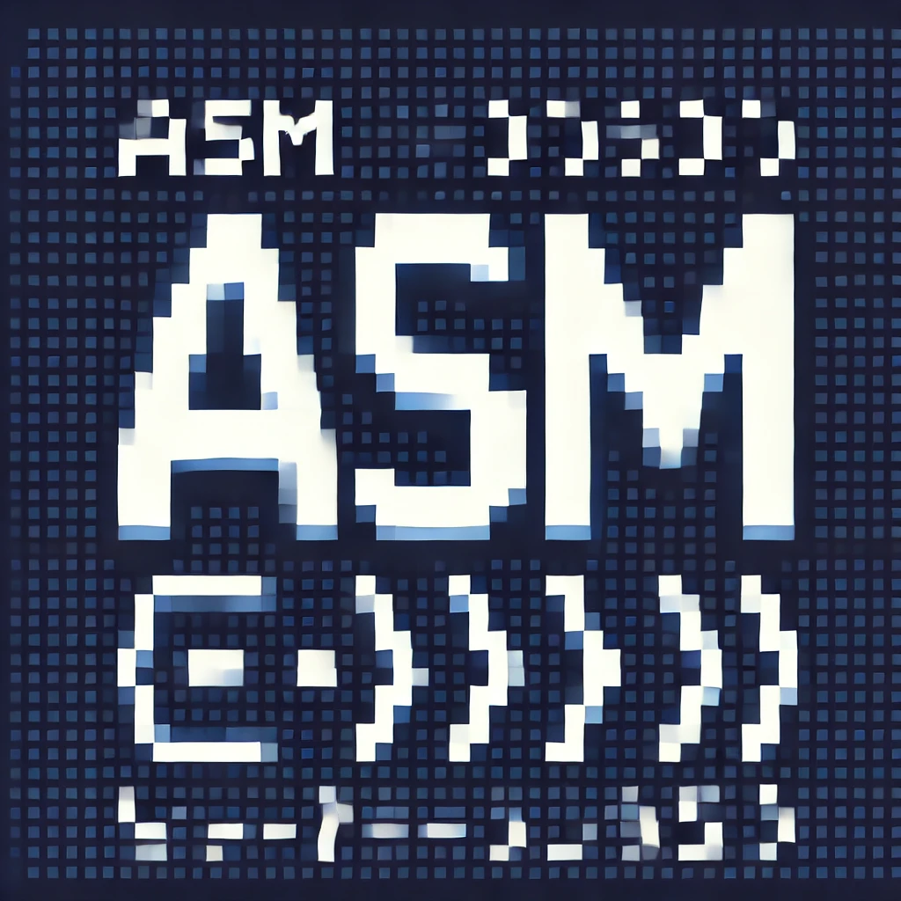

# Assembly Endgame

<p align="center">
  
</p>

A React-based word guessing game where you must save programming languages from the takeover of Assembly!

## 🎮 Game Overview

Assembly Endgame is a Hangman-style word guessing game with a programming twist. You have 8 attempts to guess the hidden word correctly. With each incorrect guess, one programming language is lost to Assembly. Save the programming world by guessing the word before all languages are gone!

## ✨ Features

- **Engaging Word Guessing Gameplay**: Classic Hangman mechanics with a programming theme
- **Language-Based Lives System**: Each incorrect guess causes a programming language to be lost
- **Visual Feedback**: Color-coded keyboard, farewell messages, and visual indicators for game progress
- **Celebration Effects**: Confetti animation when you win the game
- **Responsive Design**: Works on both desktop and mobile devices
- **Accessibility**: Built with accessibility in mind, including screen reader support

## 🚀 Getting Started

### Prerequisites

- Node.js (v18 or higher recommended)
- npm or yarn

### Installation

1. Clone the repository
   ```bash
   git clone https://github.com/ratnesh2507/Assembly-Endgame.git
   cd Assembly-Endgame
   ```

2. Install dependencies
   ```bash
   npm install
   # or
   yarn
   ```

3. Start the development server
   ```bash
   npm run dev
   # or
   yarn dev
   ```

4. Open your browser and navigate to `http://localhost:5173`

## 🛠️ Technologies Used

- [React 19](https://react.dev/)
- [Vite](https://vitejs.dev/) for fast development and bundling
- [react-confetti](https://www.npmjs.com/package/react-confetti) for win celebrations
- CSS for styling
- [clsx](https://www.npmjs.com/package/clsx) for conditional class names

## 🧩 Project Structure

```
Assembly-Endgame/
├── public/
│   └── logo.png
├── src/
│   ├── App.jsx              # Main game component
│   ├── index.css            # Global styles
│   ├── languages.js         # Programming languages data
│   ├── main.jsx             # Entry point
│   ├── utils.js             # Helper functions
│   └── words.js             # Word dictionary for the game
├── index.html
├── package.json
└── README.md
```

## 🎯 How to Play

1. A random word is chosen at the start of the game
2. Click on letter buttons to make guesses
3. Correct guesses reveal the letter in the word
4. Incorrect guesses cause a programming language to be lost (indicated by a skull emoji)
5. Win by guessing all letters in the word before losing 8 languages
6. Lose if Assembly is the only language left!
7. Click "New Game" to play again after winning or losing

## 🧪 Development

### Available Scripts

- `npm run dev` - Start the development server
- `npm run build` - Build for production
- `npm run lint` - Run ESLint to check code quality
- `npm run preview` - Preview the production build locally

## 🤝 Contributing

Contributions are welcome! Feel free to submit issues or pull requests to help improve the game.

1. Fork the repository
2. Create your feature branch (`git checkout -b feature/amazing-feature`)
3. Commit your changes (`git commit -m 'Add some amazing feature'`)
4. Push to the branch (`git push origin feature/amazing-feature`)
5. Open a Pull Request

## 📝 License

This project is open source and available under the [MIT License](LICENSE).

## 👤 Author

- **Ratnesh** - [ratnesh2507](https://github.com/ratnesh2507)

## 🔍 Future Enhancements

- Add difficulty levels with different word categories
- Implement a scoring system and high scores
- Add sound effects for game actions
- Create themed word lists related to programming
- Add multiplayer support
